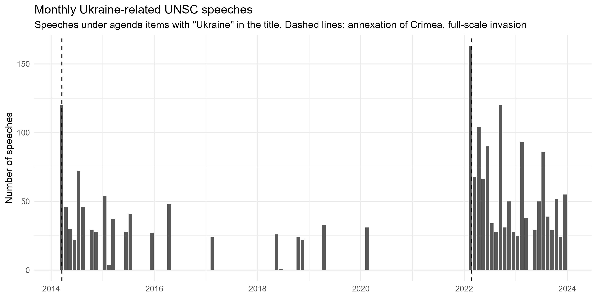
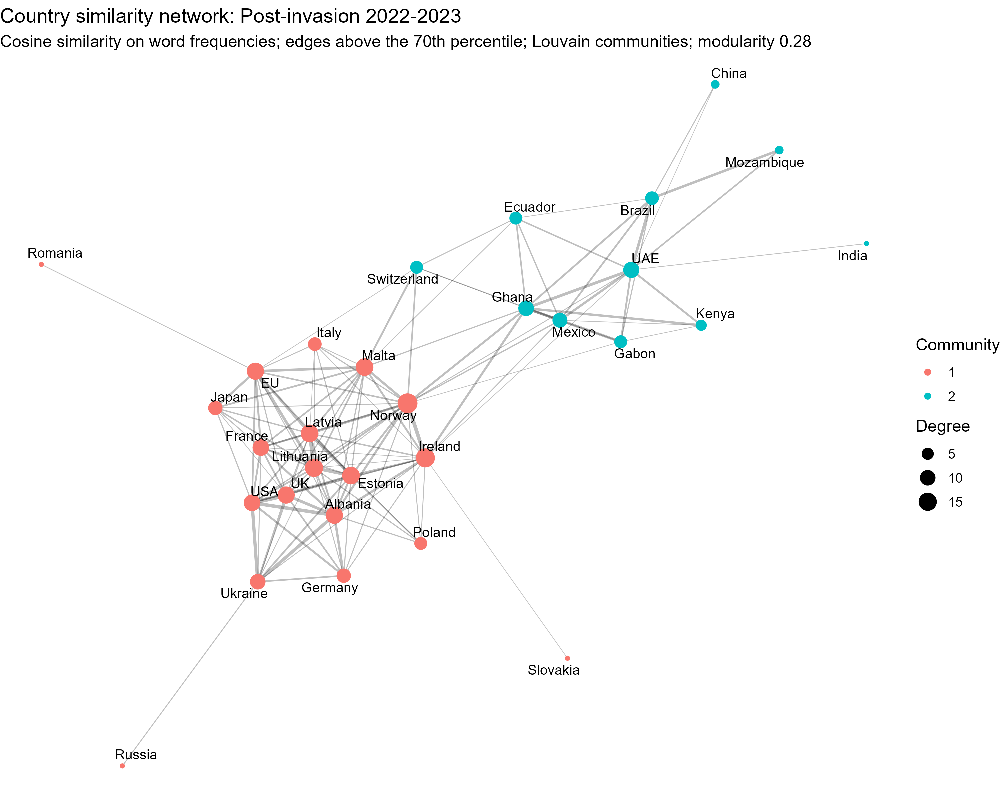

# UNSC Ukraine Speeches: Text-as-Data Analysis (2014–2023)

Analysis of UN Security Council speeches on Ukraine agenda items from 2014 to 2023: how the vocabulary of the debate changed with the full-scale invasion, how Russia and Ukraine frame the conflict, and which countries speak alike.

Originally a project at the University of Bayreuth (May–August 2025), presented at Days of Ukraine in Bavaria, German-Ukrainian Academic Society / University of Bayreuth, October 2025. The original analysis scripts were only partly preserved. The code in this repository is a reimplementation against the published corpus, and the results below come from this code.

## Research question

Can text data analysis of UN Security Council speeches reveal both distinct geopolitical blocs and their evolving narrative strategies throughout the Russo-Ukrainian conflict from 2014 to 2023?

## Data

Schoenfeld, M., Eckhard, S., Patz, R., van Meegdenburg, H., & Pires, A. *The UN Security Council Debates.* Harvard Dataverse. https://doi.org/10.7910/DVN/KGVSYH

Dataset paper: *The UN Security Council debates 1992–2023*, arXiv:1906.10969

106,302 speeches from public UNSC meetings, 1992–2023, based on transcripts with the S/PV document symbol, with metadata on speaker, country and agenda item. Speeches are selected here by agenda title containing "Ukraine": 2,102 speeches in total, 2,095 in 2014–2023.

The corpus is not redistributed here. See `data/README.md`.

## Preprocessing

- Straight and curly apostrophes unified
- Interpretation markers removed, e.g. "(spoke in Spanish)"
- Opening speaker line removed, e.g. "Mr. PICKERING (United States of America):", so a speaker's own country name is not counted as part of the speech
- Lowercased; punctuation, numbers and English stopwords removed

## Analyses

| Script | Content |
|---|---|
| `notebooks/01_corpus_temporal.R` | Corpus loading, speeches by country, monthly volume, keyness |
| `notebooks/02_similarity_network.R` | Country similarity networks, full period and split at 24 February 2022 |
| `notebooks/03_russia_and_clusters.R` | Robustness of Russia's network position; keyness between post-invasion communities (runs 02 first) |

**Keyness** (`textstat_keyness`, chi-squared): pre- vs post-invasion speeches; Russia vs Ukraine; the two post-invasion network communities.

**Similarity networks**: speeches grouped by country (countries with at least 5 speeches in the period); document-feature matrix trimmed at `min_termfreq = 2`, `min_docfreq = 2`, proportionally weighted; pairwise cosine similarity; edges kept above the 70th percentile of similarities; Louvain community detection in `igraph`. The words *ukraine, ukrainian, situation, regarding* are removed for the networks only. Speakers recorded as UN, OSCE and Save Ukraine are excluded; the EU is kept.

In the keyness comparison between the two post-invasion communities, single-word country names are also removed, because speakers name their own country.

## Findings

### 1. Vocabulary before and after the full-scale invasion

2,095 speeches in 2014–2023; 1,212 of them fall after 24 February 2022.

Most distinctive words before the invasion: *minsk, agreements, osce, eastern, crimea, mission, monitoring, separatists, ceasefire, contact, normandy.*
After the invasion: *war, food, children, grain, global, nuclear, crimes, infrastructure, energy, sexual, black, plant.*

Before the invasion the list is dominated by terms of the Minsk agreements and the OSCE monitoring mission; after it, by terms about the war and its humanitarian effects.



Months with no speeches under these agenda items are shown as zero. Of the 118 months between the first and the last speech in 2014–2023, 74 have no speech under these agenda items.

### 2. Russia and Ukraine frame the conflict differently

Most distinctive of Russia compared with Ukraine: *kyiv, western, west, regime, donbas, maidan, nationalists, nato, washington, american.*
Most distinctive of Ukraine: *russian, occupied, russia, aggression, charter, nations, illegal, occupation, putin's, invasion, terror, seat.*

Ukraine's distinctive words include terms of international law (*charter, illegal, occupation*) and direct references to Russia and Putin. Russia's include references to the West (*western, west, nato, washington, american*) and to Ukrainian domestic politics (*maidan, nationalists, regime*).

### 3. After the invasion, the rest of the Council converged without Russia

Before the invasion, Russia sat in the middle of the network: 12th least similar of 29 countries. Its most similar countries were France (0.77) and Ukraine (0.76), which together with Russia and Germany formed the Normandy format.

After the invasion it is the 2nd least similar of 30. Its number of network connections at different edge thresholds:

| Threshold (percentile) | 50th | 60th | 70th | 80th |
|---|---|---|---|---|
| Pre-invasion | 14 | 10 | 8 | 7 |
| Post-invasion | 3 | 1 | 1 | 0 |

Russia's own mean similarity changed little (0.59 to 0.56). What changed is that the other countries became more similar to each other: the 70th-percentile similarity rose from 0.63 to 0.74. Russia's most similar country after the invasion is still Ukraine (0.76); in the network below, Russia's only remaining edge is to Ukraine. This shows what the measure captures: a shared agenda, not a shared position.

### 4. Post-invasion, the Council splits by how it names the war

Before the invasion, Louvain finds two main communities. One contains the four Normandy-format states (France, Germany, Russia, Ukraine) together with the United States, United Kingdom, Australia, Luxembourg, Lithuania, Poland and Sweden. The other contains 15 countries: Chile, Rwanda, Nigeria, Jordan, Argentina, Malaysia, Republic of Korea, New Zealand, Angola, Chad, Spain, Belgium, Bolivia, Netherlands and Venezuela. China, Indonesia and Ireland have no edges above the threshold.

After the invasion, Louvain finds two communities:

- **A**: United States, United Kingdom, France, Germany, Italy, EU, Baltic states, Poland, Albania, Malta, Ireland, Japan, Norway, Ukraine (Russia, Romania and Slovakia are attached by a single edge and are left out of the keyness comparison)
- **B**: Brazil, Ghana, Mexico, United Arab Emirates, Ecuador, Gabon, Kenya, Mozambique, Switzerland, China (India is attached by a single edge and is left out of the keyness comparison)

Most distinctive of A: *russia, aggression, forces, crimes, illegal, putin, occupied, unprovoked, invasion, killed.*
Most distinctive of B: *parties, conflict, humanitarian, dialogue, hostilities, negotiations, solution, cessation, settlement, crisis, restraint.*

A uses *invasion*, *aggression* and Russia's name far more often than B. B uses *conflict*, *parties*, *dialogue* and *restraint* far more often than A (*restraint*: 52 times in B, 2 in A).



## Limitations

- Only meetings with "Ukraine" in the agenda title are included. Ukraine-related debates held under other agenda items are missed.
- The corpus covers public meetings with an S/PV record. Council activity without such a record is not included.
- Word-frequency similarity measures shared vocabulary, not shared position. Ukraine is among Russia's two most similar countries in both periods.
- Modularity is 0.26–0.28 in all networks: the communities are tendencies, not sharp blocs. Countries on the boundary change community with small preprocessing changes; Norway moved between the two post-invasion communities during development.
- Keyness compares frequencies. It does not show how a word is used; interpretations above should be checked against example sentences (`kwic`).
- The post-invasion communities and the keyness comparing them come from the same data, so that comparison describes the communities rather than testing them.
- Countries with fewer than 5 speeches in a period are excluded from that period's network.

## Relation to the original poster

The poster also showed a cross-conflict comparison of speech volume and a chart of sentiment toward DPR/LPR recognition. In the surviving scripts, neither is computed from the corpus: the speech counts are generated from assumed attention levels multiplied by conflict duration, and the sentiment scores are entered by hand. These figures are not reproduced here. The poster stated that geopolitical blocs persist throughout the conflict period; the reimplementation finds that the network structure changes with the invasion (findings 3 and 4).

## Running

```r
# from the repository root, with the corpus in data/raw/
source("notebooks/01_corpus_temporal.R")
source("notebooks/03_russia_and_clusters.R")   # runs 02 as well
```

R packages: tidyverse, quanteda, quanteda.textstats, lubridate, igraph, ggraph.

## Figures

- `figures/monthly_volume.png`
- `figures/top20_countries.png`
- `figures/network_2014_2023.png`
- `figures/network_pre_invasion_2014_2022.png`
- `figures/network_post_invasion_2022_2023.png`

## Authors

Ahmet Can Satıcı, M.A. Social and Cultural Anthropology, University of Bayreuth
Eric Macpherson Bailón

The original project was joint work. The code in this repository was rewritten by Ahmet Can Satıcı.

## License

MIT for the code. The corpus is subject to its own terms.
